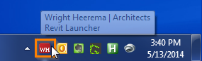
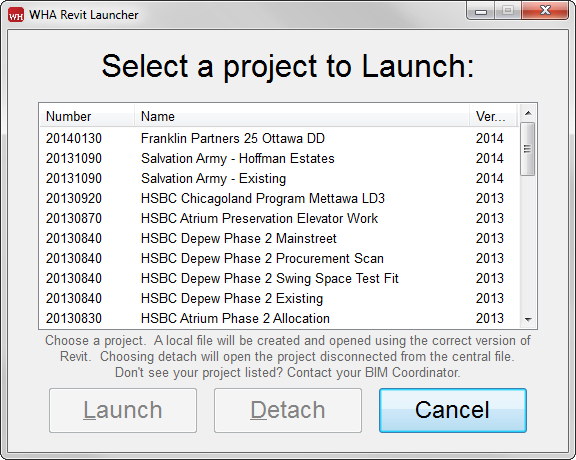
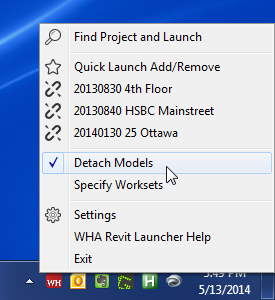
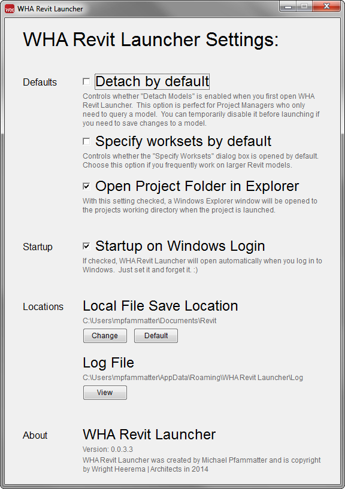

WHA Revit Launcher
==================

The WHA Revit Laucher is a utility that automates the creation of Revit Local files to get you working faster.

Features:
---------
Lists all active Revit Projects for the office
Automatically creates a "local file" on your local computer in the "MyDocuments/Revit" folder
Launches your project with the correct version of Revit
Saves a back-up of the last two "local files" created for a particular project
Launches the Worksharing Monitor to show who else is in the project
Allows for easy "detaching" of a model
 
How It Works:
-------------
The utility points to a file located on the network, "S:\AutoCAD & Revit Standards\Revit Standards\Support\Automation\WHA Revit Launcher\WHA RL Project List.ini".  From here on out, we will refer to this file as the global project list.

The global project list a list of all current Revit projects the company is working on which includes the version of Revit the project is supporting.  When a project is chosen to be launched, the Revit Laucher checks this file for the correct settings.  It will then create a backup of any old local files.  A new local file is created from the latest central file and the new local is opened.

Getting Started:
----------------
To launch a project, click on Revit Launcher icon in your task tray.

This will pop up a menu.  Choose the "Find and Launch" option to get a list of projects to launch.

Projects are listed by project number in decending order.  Once you have a project selected the "Launch" and "Detach" buttons will become available.

Should you choose "Launch", a local file will be created automatically.  Any old locals will be backed up, and the new local will be launched using the correct version of Revit.

If you picked "Detach", Revit will open your model completely disconnected from the central file.

You're welcome.

Quick Launch Menu:
------------------
In order to get you going even faster, the Revit Launcher lets you add your frequenly accessed projects to a "Quick Launch" menu.  Add projects to your menu by choosing the "Quick Launch Add/Remove" button.

Choose "Add a Project" and select the project you would like to add from the list.  You will notice the project is now available as soon as you click on the Revit Launcher icon in the menu tray.  Projects are added to the list numerically by project number.  For the time being, it is only possible to add projects to your list one-at-a-time.

Don't want a project in your list any longer? Click "Quick Launch Add/Remove" this time choosing "Remove a Project".  Select the project you want to remove and you are finished.  The project no longer shows in the Quick Launch menu.

Detach A Model:
---------------
When a project is choosen from the quick launch menu, a local is created by default.  Should you want to detach a project instead, Click the "Detach Models" option below your list.

Once selected, the icons for the projects in your Quick Launch menu will change to show the detach symbol.  Choose a project to launch and it will be opened in the correct version of Revit with no connection to the central file. 

Local files are not copied to your computer when the Detach Models option is selected as they are not required.

It is possible to set Detach Models as the default setting by enabling the "Detach by default" option in the Settings menu.  This is the perfect option for project managers and casual Revit users.

Settings:
---------

###Defaults###
These setting change the default behavior of the Revit Launcher Application.  Refer to the settings dialog menu for additional information on each option.

###Startup###
After the Revit Launcher Application has been started the first time, it will continue to open every time you log onto your computer.  An option to disable this behavior has been included should you find it intrusive.

###Locations###
It is possible to change where your local files are stored on your local computer.  In order to maintain good performance with Revit, make sure the local save location is pointing to a hard drive on your local computer.

Managing the Global Project List:
---------------------------------
Because the global project list is located on the S:\ drive, only users who have write access to the S:\ drive have the option titled "Manage Global Project List".  If you do not see this option when clicking on the task bar icon, you do not have write access to the list.  Refer to your friendly BIM Coordination should you need a project added or changed.